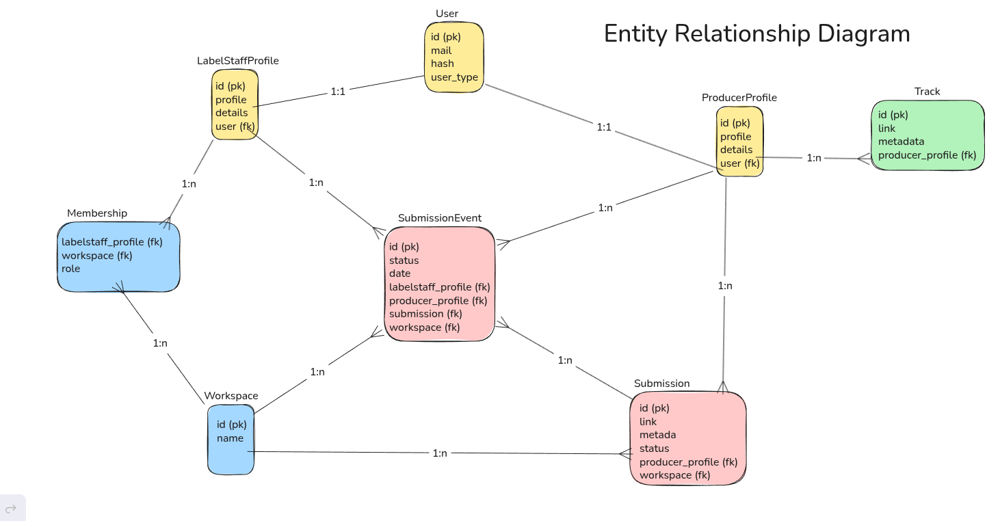
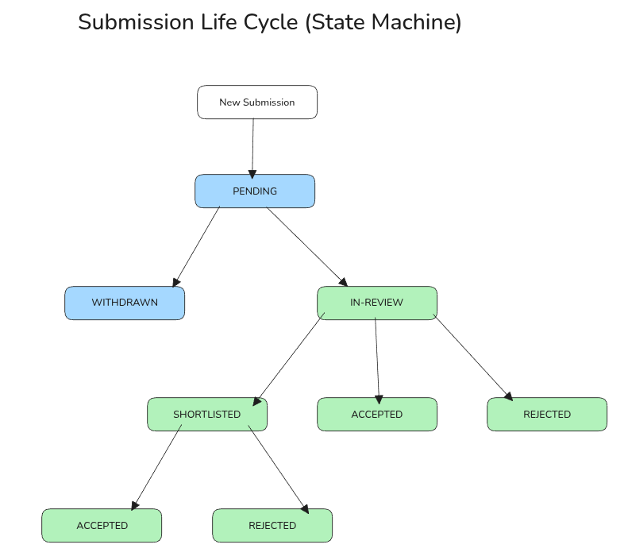

# System Overview
The system is designed to allow managing music demos as a structured, state-driven workflow. Each state change creates an immutable event stored for history. The core design philosophy follows the principles of layered architecture.


## Core System Invariants
- A user has exactly one user type: producer or labelstaff.
- A submission can only have one state at a given time.
- A submission event belongs to exactly one actor (either producer or labelstaff)
- Only label admins can manage workspaces
- Every submission must belong to only one workspace and one producer
- Only labelstaff belonging to a workspace can act on submissions in that workspace
- SubmissionEvents are immutable


## Domain Model Overview
In the current version there are 8 models in total, out of which 4 are aggregate roots.

- First and foremost there are **Users**. Represents identity and authentication. Handles basic authorization via a password-based flow. **Aggregate Root**

- **ProducerProfile** contains all domain-specific data related to a producer and defines the user as a producer. 1-1 relation with User.

- **LabelstaffProfile** is analogous to ProducerProfile, but for the label side of the platform. Defines the user as labelstaff. 1-1 relation with User.

- **Track** represents a music demo uploaded by a producer. A track is the original piece of music and exists independently of any submission.They are not reviewed or processed by labels directly. Each track belongs to exactly one ProducerProfile. **Aggregate Root**

- **Workspace** represents a label and acts as an ownership and permission boundary. All submissions and labelstaff memberships are scoped to a workspace. **Aggregate Root**

- **Membership** is an association object joining LabelstaffProfile and Workspace. In addition to linking both entities, it tracks the role of a labelstaff member within a workspace.

- **Submission** is the core entity of the system. They are distinct from tracks and represent the workflow object shared between producers and labels. Submissions are the only entity actively managed and processed by both parties. **Aggregate Root**

- **SubmissionEvent** is an immutable, snapshot of a submission’s state transition. Serves as the system’s source of truth and audit log for submission history.



## Submission Lifecycle (State Machine)


Each Submission must follow a predefined lifecycle. Each state colored in blue is triggered by Producers, each state colored in green is triggered by Labelstaffs. Each submission captures a snapshot of the track's metadata at that moment, ensuring history remains accurate even if the producer modifies the original track record later. 

Statuses are represented by a custom Enum in app/models/models.py.
```python
class Status(str, Enum):
    PENDING = "PENDING"
    WITHDRAWN = "WITHDRAWN"
    IN_REVIEW = "IN_REVIEW"
    SHORTLISTED = "SHORTLISTED"
    ACCEPTED = "ACCEPTED"
    REJECTED = "REJECTED"
```
- **Pending**: initial status of a new submission upon creation.
- **Withdrawn**: can only take place before moving to "In review". Triggered by the producer, closes the submission lifecycle.
- **In Review**: the label has opened and listened to the submission at least once. No judgment or intent is implied. The main purpose of this state is to provide feedback to the producer and serve as an anti-ghosting measure. In the future, labels with many submissions stuck in "PENDING" might be visible to producers via a "average reply time" metric.
- **Shortlisted**: the label has explicitly marked the submission as promising and worth further consideration. Essentially notifies the producer of the track being reviewed and processed.
- **Accepted**: demo has been accepted for future release. Ends the lifecycle.
- **Rejected**: demo has been denied. This ends the lifecycle.


## Submission Events History
On top of the State Machine this system also maintains an immutable audit log of all submission related state changes through **SubmissionEvents**. It does not serve as the source of truth that guides the progression of a Submission. Submissions have their own attribute called "status" which dictates the workflow. [Reference](#submission-lifecycle-state-machine)

- Submission events are created whenever a state change action occurs related to a Submission.
- Each event logs who performed the action and when.
- Events are append-only and cannot be modified or deleted once created.
- Stored in a dedicated database table indexed by submission ID and timestamp to support efficient retrieval of history.
- Events serve as a historical record for tracking all actions performed on a submission.


## Access Rules (who can do what)
The system enforces strict role-based access rules to ensure that submissions, workspaces, and user actions remain consistent and secure.

### User Roles

- **Producer**: Represents an artist submitting demos to labels.
    - Can create submissions.
    - Can view their own submissions and their full history.
    - Can withdraw a submission only while it is in PENDING.
    - Cannot modify submissions after creation.
    - Cannot change submission states other than withdrawal.
    - Has no access to workspaces or other producers’ data.

- **Labelstaff Member**: Represents a member of a label who reviews and manages submissions within a workspace.
    - Can view submissions belonging to their workspace.
    - Can update submission status in accordance to the State Machine Flow.
    - Actions are limited to workspaces they are members of.

- **Labelstaff Admin**: A labelstaff member with elevated permissions inside a workspace. Can manage reviews and the workspace itself.

State transitions are only allowed if the acting user has the required role, the submission belongs to the same workspace or producer profile as the actor, the transition is valid for the submission’s current state.


## Code Architecture
The system has three layers:
- HTTP communication layer: handles requests, responses and errors.
- Service layer: manages all of the core business logic.
- Data access and persistence layer: interacts with database to save and fetch data.

### App file structure
- `app/models/models.py` - Database ORM models
- `app/routers/` - Aggregate root specific endpoints
- `app/schemas/schema.py` - Pydantic models
- `app/services/` - Core business logic divided into separate components
- `app/database.py` - Database connection set up
- `app/dependencies.py` - FastAPI depedency factory
- `app/main.py` - Main app file
- `app/settings.py` - Config


#### Last update: 23/01/2026
#### Document version: v1.1